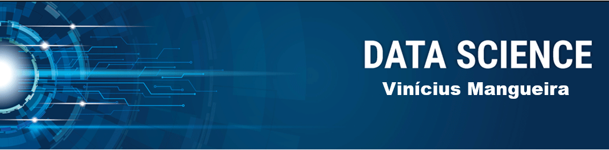

  

Atualmente no 7º período no bacharelado em Matemática. Na matemática adquiri conhecimentos nas áreas de Álgebra Linear, Análise e, principalmente, Geometria Diferencial. Agora, busco me desenvolver na área de ciência de dados, introduzindo minhas habilidades na matemática para machine learning, sempre buscando aprender novas ferramentas e tecnologias para contribuir no ambiente corporativo. 

**Background in:** Python, Machine Learning, Álgebra Linear e  Análise.

**Links:**
* [LinkedIn](https://www.linkedin.com/in/vinícius-mangueira-a94aa5204/)
* [Medium](https://medium.com/@viniciusrfm)

# Data_Science
Meu Portifólio de Data Science

## Projetos:
Veja os tutoriais publicados do Sigmoidal:

* **Análise dos Dados do Airbnb - Atenas:** 
